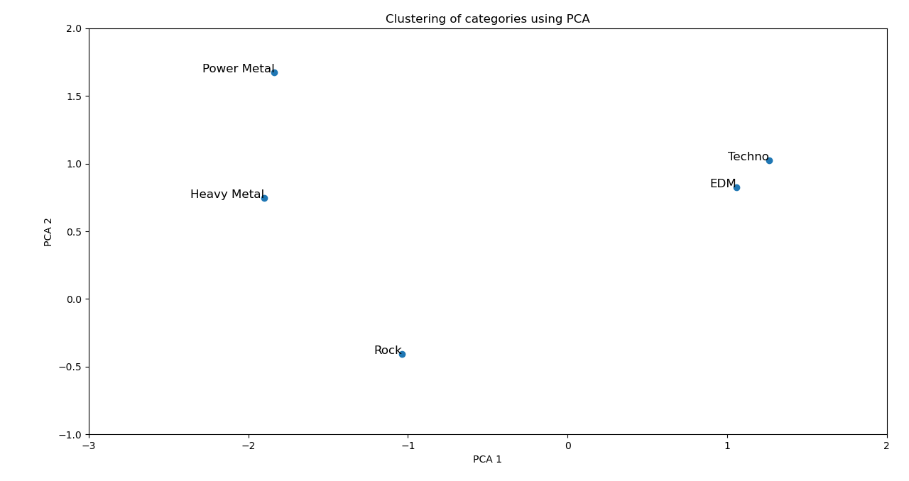

# Mini projet modélisation

## Morceaux

(Règle imposée à moi-même : Pas de répétition d'artiste)

1. The Killers - Mr. Brightside
2. Sum 41 - In Too Deep
3. Ultra Vomit - ÉVIER METAL
4. Porter Robinson - Goodbye To A World
5. My Chemical Romance - Welcome To The Black Parade
6. Smash Mouth - All Star
7. Green Day - Boulevard Of Broken Dreams
8. Marillion - Kayleigh
9. S3RL - Techno Kitty
10. John Williams - Imperial March
11. Hans Zimmer - Cornfield Chase
12. blink-182 - I Miss You
13. Queen – Bohemian Rhapsody
14. C418 - Sweden
15. Coldplay - Viva La Vida
16. Lena Raine - otherside
17. The OneUps - Kirby's Dream Land - Green Greens
18. Tomohito Nishiura - Professor Layton's Theme
19. Miki Matsubara - Stay With Me
20. Mariya Takeuchi - Plastic Love
21. Yumi Arai - Hikouki Gumo
22. Dragon Force - Through The Fire And Flames
23. succducc - me & u
24. Kuba Oms - My Love
25. Mrs. GREEN APPLE - インフェルノ(Inferno)
26. Xi - Freedom Dive
27. KANA-BOON - Silhouette
28. Neck Deep - December
29. Mayday Parade - Black Cat
30. Elton John - Rocket Man
31. The Wonder Years - Cardinals
32. Crystal Dolphin - Engelwood
33. Imagine Dragons - Warriors
34. Sleeping With Sirens - If You Can't Hang
35. Pierce The Veil - King for a Day
36. Noma - Brain Power
37. MAN WITH A MISSION - Raise your flag
38. Silent Siren - Routine
39. Bill Withers - Just The Two Of Us
40. VINXIS - Sidetracked Day
41. Reol - Asymmetry
42. Cartoon - Whatever I Do
43. YUC'e - Future Candy
44. Initial D - Deja Vu
45. Muse - Supermassive Black Hole
46. Ludwig Göransson - Can You Hear The Music
47. Hatsune Miku - Mythologia's End
48. BABYMETAL - Gimme chocolate!!
49. Nanaki - Mousou Kajitsu
50. Camellia - Exit this Earth's Atomosphere

## Catégories

(Les Catégories ont étaient choisis avant d'avoir trouvé les morceaux)

1. Female vocal     (voix feminine majoritaire)
2. Male vocal       (voix masculine majoritaire)
3. Fast paced       (Rythme rapide ou très rapide)
4. Medium Slow      (Rythme lent ou moyen)
5. Strongly Emotive (Qui suscite fortement l'émotion)
6. English          (Majorité de paroles en Anglais)

Toutes les catégories seront assignées aux morceaux choisis sur la base du "feeling"
Ce qui signifie que si un morceau me semble "Emotif" alors, je le classerai dans la catégorie "Strongly Emotive".

Ainsi, les catégories 3,4 et 5 sont très biaisées par ma propre interprétation, car il n'existe pas de ce que j'appelle "*des règles d'assignation binaire évidente*" pour ces catégories.

Le classement des morceaux se trouve dans le fichier [data.yaml](./data.yaml)

### C'est quoi une "règle d'assignation binaire" ?

J'appelle une règle d'assignation binaire, une règle qui permet de répondre par oui ou non à la question "Est-ce que ce morceau appartient à cette catégorie ?"

Exemple :
On aurait pu imaginer que la catégorie "Fast paced" soit assignée suivant la règle d'assignation binaire : "Si le morceau a un BPM supérieur à 150, alors il est Fast Paced"

Grâce à cette règle, on peut savoir pour n'importe quel morceau de musique existant s'il appartient ou non à notre interprétation de la catégorie "Fast Paced"

Par contre, on remarquera qu'il n'est pas toujours aussi facile de trouver une règle d'assignation binaire qui soit juste :

Par exemple, pour la catégorie "Strongly Emotive" il est assez difficile d'en trouver une qui a du sens :

On pourrait quand même inventer la règle suivante : "Si le morceau contient plus de 20 mots parmi le vocabulaire proche de l'émotion, alors il est Strongly Emotive".

Mais alors:

- Quid des morceaux sans paroles ?
- Quid de ce qu'est le "vocabulaire proche de l'émotion"
- ...

On pourra aussi constater que certaines catégories semblent dans certains cas avoir une règle d'assignation binaire *évidente* (plus simple à trouver):

Par exemple :

Pour la catégorie English: "Si un morceau a une majorité de paroles dans la langue Anglaise, alors il est English."

Pour ma conception de la catégorie English, cette règle parait parfaite, donc c'est pour moi une *règle d'assignation binaire évidente*.

La question est donc la suivante : "Comment associer le plus justement possible des règles d'assignation à des catégories ?"

Imaginons une liste de catégories :

1. Rock
2. Heavy Metal
3. Punk Rock
4. Power Metal

Et une liste de règle :

1. "Has an electrical guitar"
2. "Has a drum"
3. "Has a bass"
4. "Has fantasy based lyrics"
5. "Has heavy bass"
6. "Has heavy drums"
7. "Has loud and distorded guitars"
8. "Has a fast tempo"
9. "Has a sense of Authenticity"

Une attribution correcte pourrait être :

| Rules                           | Rock | Heavy Metal | Punk Rock | Power Metal |
|:-------------------------------:|:----:|:-----------:|:---------:|:-----------:|
| Has an electrical guitar        | 1    | 1           | 1         | 1           |
| Has a drum                      | 1    | 1           | 1         | 1           |
| Has a bass                      | 1    | 1           | 1         | 1           |
| Has fantasy based lyrics        | 0    | 0           | 0         | 1           |
| Has heavy bass                  | 0    | 1           | 0         | 1           |
| Has heavy drums                 | 0    | 1           | 0         | 1           |
| Has loud and distorted guitars  | 0    | 1           | 0         | 1           |
| Has a fast tempo                | 0    | 0           | 1         | 1           |
| Has a sense of Authenticity     | 0    | 0           | 1         | 0           |

Mais comment faire pour trouver une stratégie d'attribution automatique ?

### Idée naïve: clustering de catégories

Imaginons 5 catégoies : 

1. Rock
2. Heavy Metal
3. Power Metal
4. Electronic Dance Music (EDM)
5. Techno

Pour chacune des catégories, on introduit nous-même au moins 2-3 règles prédéfinis

| Rules                            | Rock | Heavy Metal | Power Metal | EDM | Techno |
|----------------------------------|------|-------------|-------------|-----|--------|
| Has an electrical guitar         | 1    | 1           | 1           | 0   | 0      |
| Has a drum                       | 1    | 1           | 1           | 0   | 0      |
| Has a bass                       | 1    | 1           | 1           | 0   | 0      |
| Has loud and distorted guitars   | 0    | 1           | 1           | 0   | 0      |
| Has heavy drums                  | 0    | 1           | 1           | 0   | 0      |
| Has heavy bass                   | 0    | 1           | 1           | 0   | 0      |
| Has fantasy based lyrics         | 0    | 0           | 1           | 0   | 0      |
| Has a fast tempo                 | 0    | 0           | 1           | 1   | 1      |
| Has synthesizers                 | 0    | 0           | 0           | 1   | 0      |
| Has electronic beats             | 0    | 0           | 0           | 1   | 1      |
| Has repetitive beats             | 0    | 0           | 0           | 1   | 1      |
| Has a bass-heavy kick            | 0    | 0           | 0           | 0   | 1      |
| Has electronic instruments       | 0    | 0           | 0           | 0   | 1      |

Moi, quand je vois une matrice comme celle-là, je pense tout de suite à l'analyse en composante principale :D

Après une simple implémentation de la PCA (avec un peu d'aide de ollama starcoder2), on peut créer le graph suivant :

Et en effet, on remarque bien deux clusters se préciser.

On pourra alors ajouter des catégories et inférer avec plus ou moins de risque d'autres règles d'assignation sur la base de nos clusters.

